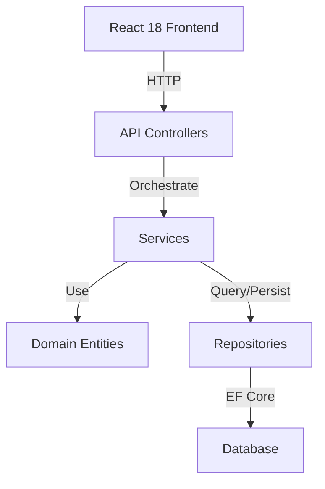

# System Architecture Design

Design comprehensive system architecture, component frameworks, and integration patterns based on requirements.

## When to Use

- Designing initial system architecture from requirements
- Planning layer decomposition (presentation, business logic, data access)
- Defining component boundaries and responsibilities
- Creating system-wide integration patterns
- Planning for scalability and resilience
- Designing cross-cutting concerns (logging, error handling, caching)

## Process

### 1. Analyze Requirements

**Input:** requirements.md or user story description

**Extract:**
- Core business domains
- User workflows
- Data entities and relationships
- External integrations
- Non-functional requirements (performance, scalability, security)
- Future growth considerations

### 2. Define Architecture Layers

For .NET 8 Web API + React 18 projects, recommend this layering:

```
Presentation Layer (React 18 Frontend)
    ↓
API Contract Layer (.NET Controllers)
    ↓
Application Layer (Services, DTOs)
    ↓
Domain Layer (Entities, Business Logic)
    ↓
Data Access Layer (Repositories, EF Core)
    ↓
Infrastructure Layer (Database, External Services)
```

**Each layer has specific responsibilities:**

- **Presentation:** React components, state management, UI logic
- **API Contract:** Controllers, request/response handling, validation
- **Application:** Business rules, workflow orchestration, DTO mappings
- **Domain:** Core entities, value objects, business logic
- **Data Access:** Database queries, persistence operations
- **Infrastructure:** Database connections, external API calls, caching

### 3. Design Component Boundaries

Define components based on domain boundaries (domain-driven design):

- **Identify bounded contexts** - Separate business domains
- **Define domain entities** - Core objects in each context
- **Specify component interfaces** - How components communicate
- **Plan dependencies** - Direction of dependencies (avoid circular)

**Template:**

```markdown
### Component: {Name}

**Responsibility:** {Clear single purpose}

**Entities:**
- {Entity 1} - {role}
- {Entity 2} - {role}

**Dependencies:**
- {Depends on} → {reason}

**Public Interface:**
- Get{Entity}() - {description}
- Create{Entity}() - {description}
- Update{Entity}() - {description}

**Integration Points:**
- {Other component} - {how it integrates}
```

### 4. Define Integration Patterns

**Backend to Database:**
- Repository pattern for abstraction
- Entity Framework Core for ORM
- Migrations for schema management

**Frontend to Backend:**
- RESTful API with envelope pattern
- Request/response DTOs
- Error handling conventions

**Between Backend Components:**
- Dependency injection for service communication
- Async/await for non-blocking operations
- Cancellation token propagation

**External Integrations:**
- Adapter pattern for third-party services
- Circuit breaker for resilience
- Retry policies with exponential backoff

### 5. Document Architecture Decisions

Create ADR (Architecture Decision Record) for each major decision:

```markdown
### ADR: {Decision Title}

**Status:** Proposed/Accepted/Superseded

**Context:** {Why this decision is needed}

**Decision:** {The chosen approach}

**Rationale:** {Why this approach over alternatives}

**Consequences:**
- Positive: {Benefits}
- Negative: {Tradeoffs}
```

### 6. Create Architecture Visualization

Produce ASCII or Mermaid diagrams showing:
- Layer relationships
- Component dependencies
- Data flow between components
- External system connections

Example Mermaid diagram:



## Best Practices

### Single Responsibility Principle
- Each layer has one reason to change
- Each component handles one business concern
- Clear boundaries prevent confusion

### Dependency Inversion
- Depend on abstractions (interfaces), not concrete classes
- Register dependencies in DI container
- Test by mocking dependencies

### Separation of Concerns
- UI logic stays in React
- Business rules in services/domain
- Database queries in repositories
- Don't mix layers

### Scalability Considerations
- Design for horizontal scaling (stateless services)
- Separate read and write models if needed (CQRS)
- Plan for caching strategies
- Consider async messaging for high-volume operations

### Error Handling Strategy
- Define error types and codes (ORG-XXX-YYY format)
- Consistent error response format
- Logging at appropriate levels
- User-friendly error messages

## Output Format

Document architecture decisions in `docs/ARCHITECTURE.md`:

```markdown
# System Architecture

## Overview
{High-level description of the system}

## Layers
{Layer responsibilities and boundaries}

## Components
{Major components and their roles}

## Integration Patterns
{How components communicate}

## External Integrations
{Third-party services and adapters}

## Architecture Decisions
{Key ADRs}

## Diagrams
{ASCII or Mermaid diagrams}

## Deployment Architecture
{Environment setup, scaling considerations}
```

## Implementation Checklist

- [ ] Requirements analysis complete
- [ ] Architecture layers defined
- [ ] Component boundaries identified
- [ ] Integration patterns specified
- [ ] Architecture diagrams created
- [ ] ADRs documented
- [ ] Scalability concerns addressed
- [ ] Error handling strategy defined
- [ ] Security considerations noted
- [ ] Documentation reviewed with team
